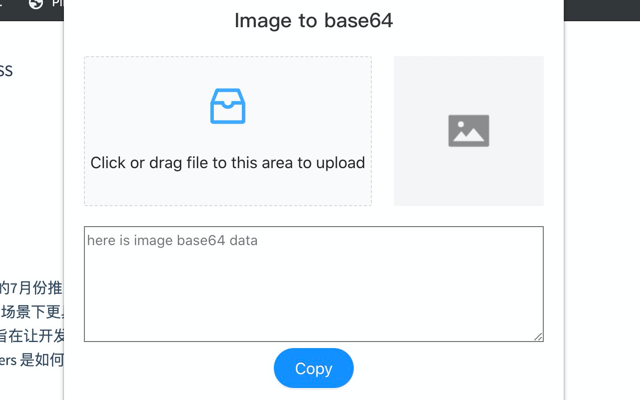
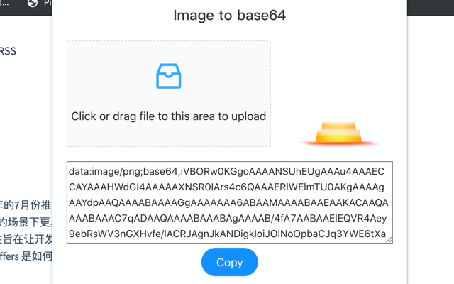
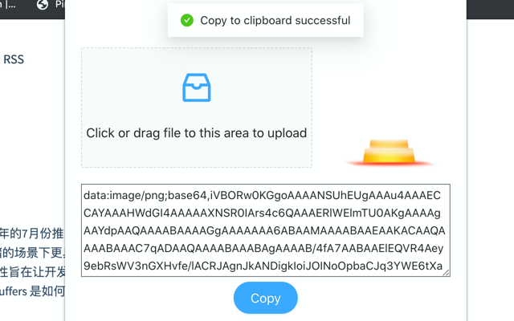

# image2base64-chrome-extension

Convert local image to base64 data for chrome extension.

## how to use

[WIP] Download from chrome web store

1. Open `https://chrome.google.com/webstore/category/extensions?hl=en-US` 
2. Search `Image To Base64`, and `Add to chrome`

Or

Download Image_To_Base64.zip

1. Open `https://github.com/Yuzeyang/image2base64-chrome-extension/releases`, find the latest version
2. Download the zip file, and uncompress it.
3. Open `chrome://extensions`
4. Click `Load unpacked`, and select Image_To_Base64.zip

Then you can convert image to base64 data in your chrome tab~🎉

## preview

1. open `Image To Base64` extension.

2. Click or drag file to the designated area, then you will see the preview image and it's base64 data below.

3. Click `Copy` button, paste it to the place that you want to use.

